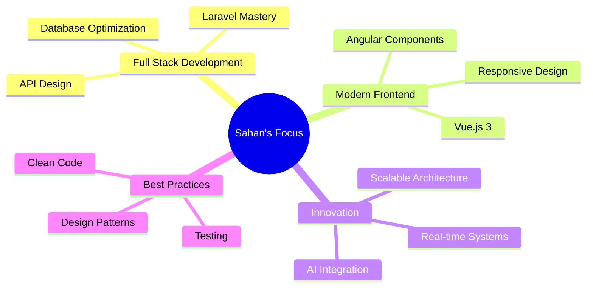

<div align="center">

# 👋 Hi, I'm Sahan Geesara


<p align="center">
  
  
</p>

</div>

---

## 🚀 About Me

```javascript
const sahan = {
    location: "Sri Lanka 🇱🇰",
    education: "BIT Diploma Level Graduate 🎓",
    currentRole: "Fullstack Developer @ Nextmatricslab 💼",
    learning: ["Full Stack Development", "OOP in PHP", "System Architecture"],
    interests: ["Clean Code", "Backend Logic", "Scalable Systems"],
    currentStreak: "87 contributions | Longest Streak: 5 days",
    motto: "Building elegant solutions to complex problems ✨"
};
```

<div align="center">

### 🔥 Current Streak Stats

```
╔════════════════════════════════════════════════════╗
║  📊 87 Total Contributions (Jan 7, 2024 - Present) ║
║  🔥 Current Streak: 1 day (Nov 22)                 ║
║  🏆 Longest Streak: 5 days (Nov 8 - Nov 12)        ║
╚════════════════════════════════════════════════════╝
```

</div>

---

## 🧰 Tech Stack

<div align="center">

### 💬 Languages


### 🧱 Frameworks & Libraries


### 🗄️ Databases


### 🧰 Tools & Platforms


</div>

---

## 💡 Featured Projects

<div align="center">

<table>
<tr>
<td width="50%">

### 🗨️ Ch-Chat
**Real-time Chat Application**

```diff
+ OOP principles & file-based storage
+ Encapsulation, inheritance, polymorphism
+ Modern real-time messaging features
+ Clean architecture pattern
```

**Tech:** PHP, OOP, JavaScript, WebSockets

</td>
<td width="50%">

### 🏨 Room Reservation System
**Hotel & Restaurant Management**

```diff
+ Laravel-based admin system
+ AI-powered recommendations
+ Smart room control integration
+ AR/VR virtual tours
```

**Tech:** Laravel, MySQL, Vue.js, AI/ML

</td>
</tr>
</table>

</div>

---

## 📊 GitHub Statistics

<div align="center">


</div>

---

## 🏆 GitHub Trophies

<div align="center">


</div>

---

## 💼 Current Focus

<div align="center">



</div>

---

## 🌐 Portfolio & Connect

<div align="center">

### 🌍 Visit My Portfolio
**[sahangeesara.netlify.app](https://sahangeesara.netlify.app/)**

### 📫 Let's Connect

[](https://linkedin.com/in/sahangeesara)
[](https://twitter.com/sahangeesara)
[](mailto:sahangeesara@example.com)
[](https://sahangeesara.netlify.app/)

</div>

---

## 📈 Contribution Activity

<!--START_SECTION:activity-->
<!--END_SECTION:activity-->

<div align="center">

### 💭 Random Dev Quote


---

### ⚡ Fun Fact

```
while(alive) {
    eat();
    code();
    sleep();
    repeat();
}
```

---


**💙 Thank you for visiting my profile!**


</div>
