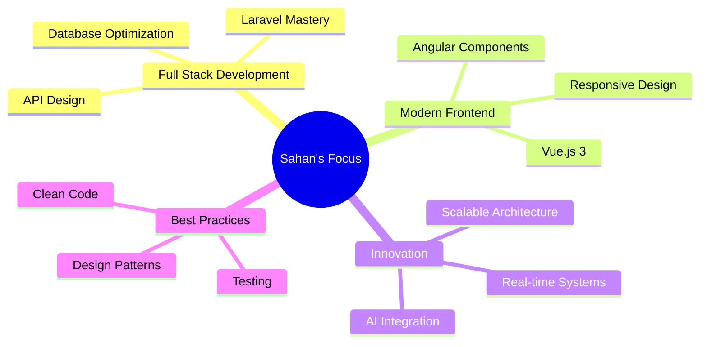

<!-- README for GitHub profile of Sahan Geesara -->

<div align="center">

# 👋 Hi, I'm Sahan Geesara


<p align="center">
  
  
</p>

</div>

---

## 🚀 About Me

```javascript
const sahan = {
    location: "Sri Lanka 🇱🇰",
    education: "BIT Diploma Level Graduate 🎓",
    currentRole: "Fullstack Developer @ Nextmatricslab 💼",
    learning: ["Full Stack Development", "OOP in PHP", "System Architecture"],
    interests: ["Clean Code", "Backend Logic", "Scalable Systems"],
    currentStreak: "87 contributions | Longest Streak: 5 days",
    motto: "Building elegant solutions to complex problems ✨"
};
```

---

## 🔥 Animated Highlights (what's moving)

* Typing effect (above) uses `readme-typing-svg` for animated header text.
* The streak image at the top is your uploaded snapshot and gives a visual cue of activity.
* You can add an animated GIF (for example build demos or UI walkthrough) by committing the GIF into the repo and linking it like ``.

---

## 🧰 Tech Stack

### Languages

    

### Frameworks & Libraries

   

### Databases

 

### Tools

Git, GitHub, GitLab, VS Code, PhpStorm, IntelliJ, NetBeans, Postman, Jira, XAMPP

---

## 💡 Featured Projects

### 🗨️ Ch-Chat

**Real-time Chat Application** – OOP-based with file storage and real-time features.

**Tech:** PHP, OOP, JavaScript, WebSockets

---

### 🏨 Room Reservation Admin System

**Hotel & Restaurant Management** – Laravel admin system with AI recommendation ideas and smart room features.

**Tech:** Laravel, MySQL, Vue.js, AI/ML

---

## 📊 GitHub Stats

<div align="center">


</div>

---

## 🏆 GitHub Trophies


---

## 💼 Current Focus



---

## 🌐 Portfolio & Connect

**Portfolio:** [https://sahangeesara.netlify.app](https://sahangeesara.netlify.app)

**LinkedIn:** [https://linkedin.com/in/sahangeesara](https://linkedin.com/in/sahangeesara)

**Twitter:** [https://twitter.com/sahangeesara](https://twitter.com/sahangeesara)

**Email:** mailto:sahangeesara@example.com

---

## 🔧 How to use this README (quick)

1. Copy this `README.md` into your `sahangeesara` GitHub profile repository (the repo named exactly `sahangeesara`).
2. Commit any media you want to show (GIFs, screenshots) into the repo (e.g. `assets/demo.gif`) and reference them with relative paths.
3. To keep contribution/activity sections updated, enable your GitHub profile repo to show the activity graph or use community actions that update the `README.md` via scheduled GitHub Actions.

If you want, I can also:

* Add a demo animated GIF (record your UI) and insert it into the README.
* Create a GitHub Action workflow file to automatically update the `Contribution Activity` section.

---

## ⚡ Fun Fact

```
while(alive) {
    eat();
    code();
    sleep();
    repeat();
}
```

---

*Thanks for visiting!*

<!-- End of README -->
